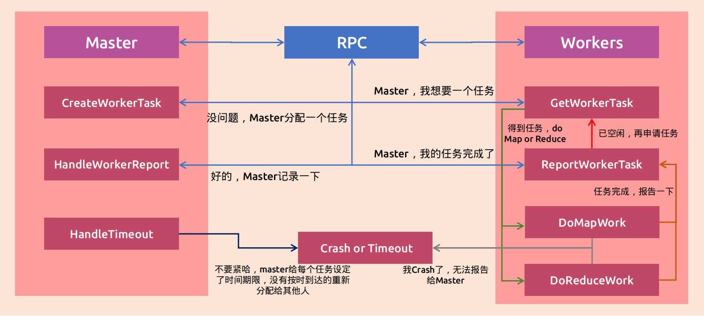

# MapReduce学习笔记

## 简介

当我们要统计数亿文本的词频，单个机器性能一般，况且是数亿级数据，处理是十分缓慢的，对于这样的任务，希望的是多台电脑共同处理，大幅度减少任务时间。联合多台电脑一起工作的系统就是分布式系统。

最近在学[MIT6.824分布式系统](https://pdos.csail.mit.edu/6.824/schedule.html)课程，第一个Lab就是MapReduce，[MapReduce](https://pdos.csail.mit.edu/6.824/papers/mapreduce.pdf)是Google公司2004年发表的一篇论文，介绍很多任务都可以分为两步操作——Map和Reduce(比如要统计词频，Map分别对每个文件生成单词和单一数目，分不同区块保存，Reduce对不同区块进行统计，得到最终结果)，可以将这两个操作之外的包装起来，只提供Map和Reduce的接口，不同任务只需要替换不同的Map函数和Reduce函数即可。论文中还讲述了MapReduce分布式系统的实现细节以及应用场景。本文将以MIT6.824课程的Lab1为例，讲述如何完成MapReduce Lab1以及实现过程中遇到一些的困难。

需要的基础：

- Go语言基础 (推荐[官网的tour](https://tour.golang.org/welcome/1))
- MIT6.824前两节的课程（[B站链接](https://www.bilibili.com/video/BV16j411f7F4)）
- 读MapReduce（主要看实现那一块）

笔记中的全部代码可以在[https://github.com/FangYang970206/MIT6.824-2020](https://github.com/FangYang970206/MIT6.824-2020)中查看下载。

## 环境配置

环境配置可以看[Lab1流程](https://pdos.csail.mit.edu/6.824/labs/lab-mr.html)，手把手地教怎么配置，主要分两步：

第一步安装Go环境

```bash
wget -qO- https://dl.google.com/go/go1.13.6.linux-amd64.tar.gz | sudo tar xz -C /usr/local
```

第二步克隆Lab1仓库

```bash
git clone git://g.csail.mit.edu/6.824-golabs-2020 6.824
```

克隆出来的仓库的src文件夹中只有几个是与MapReduce相关的，分别是：

- main目录下的mrmaster.go, mrworker.go, mrsequential.go和test-mr.sh，还有pg*.txt代表的8个文件是要分布式处理的输入，这个文件内容也不需要变，test-mr.sh有五个任务，运行test-mr.sh可以知道自己是否通过所有任务。
- mr文件夹，这个是MapReduce主要实现代码，工作量就在这了
- mrapps是不同任务的Map和Reduce函数包，这个不需要管

## 系统框架一览

MapReduce系统是由一个master进程和多个worker进程组成，master和worker之间是通过RPC(Remote Procedure Call)进行通信，master进程负责给多个worker分配任务，记录任务完成状态，并且需要处理worker奔溃或者超时运行等问题，worker需要处理相应的任务，处理完毕发送报告给master，再请求下一个任务。我根据代码函数调用逻辑画出了一个系统框图，可以更好的理解MapReduce系统的工作原理：



## 代码详解

根据上面的系统框图，现在来从代码中理解系统。

### Master结构

```go
type Flag struct {
	processing bool
	finished   bool
}

type Master struct {
	FileNames      []string
	MapFlags       []Flag
	ReduceFlags    []Flag
	MapTaskCnts    []int
	ReduceTaskCnts []int
	MapAllDone     bool
	ReduceALLDone  bool
	MapNum         int
	ReduceNum      int
	Mut            sync.Mutex
}
```

- FileNames：pg*.txt这八个文件名
- MapFlags：对应八个文件的Map任务状态，processing代表正在处理，finished表示已完成
- ReduceFlag：同上
- MapTaskCnts：这是记录Map的当前任务序列号，如果某个map任务发生timeout，HandleTimeout函数对这个map任务的processing标志清0，重新分配，当前任务的序列号在上一个任务号中加1，如果之前发生timeout的任务来报告完成，由于小于当前任务号，HandleWorkerReport函数可无需记录，直接退出
- ReduceTaskCnts：同上
- MapAllDone：Map任务全部完成为true
- ReduceAllDone：Reduce任务全部完成为true
- MapNum：Map任务数
- ReduceNum：Reduce任务数
- Mut：互斥锁，由于有多个worker，避免条件竞争发生不确定行为，master内部数据需要互斥访问

### Worker结构

```go
type TaskState int

const (
	MapState    TaskState = 0
	ReduceState TaskState = 1
	StopState   TaskState = 2
	WaitState   TaskState = 3
)

type WorkerTask struct {
	MapID          int
	ReduceID       int
	ReduceNum      int
	MapNum         int
	MapTaskCnt     int
	ReduceTaskCnt  int
	State          TaskState
	FileName       string
	MapFunction    func(string, string) []KeyValue
	ReduceFunction func(string, []string) string
}
```

- MapID和ReduceID：Map任务ID和Reduce任务ID
- MapNum和ReduceNum：Map的任务总数和Reduce任务总数
- MapTaskCnt和ReduceTaskCnt：Map任务序列号和Reduce序列号
- State：任务有四种状态，分别是MapState，ReduceState，StopState和WaitState，MapState表示当前需要处理Map任务，ReduceState表示当前需要处理Reduce任务，WaitState表示当前没有需要处理的任务，开始睡眠等待，StopState代表任务已全部完成，可以退出。
- FileName：表示Map任务需要的文件名
- MapFunction和ReduceFunction：任务根据State需要进行的Map函数或者Reduce函数

### Master接口

#### 创建Master

```go
func MakeMaster(files []string, nReduce int) *Master {
	m := Master{FileNames: files,
		MapFlags:       make([]Flag, len(files), len(files)),
		ReduceFlags:    make([]Flag, nReduce, nReduce),
		MapNum:         len(files),
		ReduceNum:      nReduce,
		MapAllDone:     false,
		ReduceALLDone:  false,
		MapTaskCnts:    make([]int, len(files)),
		ReduceTaskCnts: make([]int, nReduce),
	}
	m.server()
	args, reply := NoArgs{}, NoReply{}
	go m.HandleTimeOut(&args, &reply)
	return &m
}
```

这个函数会由mrmaster.go文件的主函数调用，创建一个master对象，需要传入文件名数组，以及要进行多少个Reduce任务，根据这两个输入，可以初始化master参数。m.server()是关于RPC的内容，这里不去谈，有兴趣可以看看博客最后关于RPC内容, 只需要知道master函数要使用RPC，函数需要是两个参数（没参数会有警告），都为指针形式，第一个表示输入参数，第二个表示输出参数，返回错误，无错误返回nil。然后创建一个线程专门处理timeout，然后将master返还给mrmaster的主函数，mrmaster主函数会确认master的MapAllDone和ReduceALLDone是否都为真，都为真则退出，否则睡眠一段时间再确认。

#### 生成worker task

```go
func (m *Master) CreateWorkerTask(args *NoArgs, workerTask *WorkerTask) error {
	m.Mut.Lock()
	defer m.Mut.Unlock()
	if !m.MapAllDone {
		for idx := 0; idx < m.MapNum; idx++ {
			if !m.MapFlags[idx].processing && !m.MapFlags[idx].finished {
				workerTask.ReduceNum = m.ReduceNum
				workerTask.MapNum = m.MapNum
				workerTask.State = MapState
				workerTask.MapID = idx
				workerTask.FileName = m.FileNames[idx]
				m.MapTaskCnts[idx]++
				workerTask.MapTaskCnt = m.MapTaskCnts[idx]
				m.MapFlags[idx].processing = true
				return nil
			}
		}
		workerTask.State = WaitState
		return nil
	}
	if !m.ReduceALLDone {
		for idx := 0; idx < m.ReduceNum; idx++ {
			if !m.ReduceFlags[idx].processing && !m.ReduceFlags[idx].finished {
				workerTask.State = ReduceState
				workerTask.ReduceNum = m.ReduceNum
				workerTask.MapNum = m.MapNum
				workerTask.ReduceID = idx
				m.ReduceTaskCnts[idx]++
				workerTask.ReduceTaskCnt = m.ReduceTaskCnts[idx]
				m.ReduceFlags[idx].processing = true
				return nil
			}
		}
		workerTask.State = WaitState
		return nil
	}
	workerTask.State = StopState
	return nil
}
```

函数首先会获得互斥锁，然后判断MapAllDone是否为false，为false进入循环遍历，如果某个任务的processing状态和finished状态都为false，说明这个任务可以需要被处理，可以分配，讲配置参数写入到输出参数中，并标志master中当前任务的状态processing为true以及序列号。如果没有任务需要处理，说明map有些任务正在处理，有些已完成。进入等待阶段。判断ReduceALLDone与前面类似。不加以叙述。

#### 处理worker report

```go
func (m *Master) HandleWorkerReport(wr *WorkerReportArgs, task *NoReply) error {
	m.Mut.Lock()
	defer m.Mut.Unlock()
	if wr.IsSuccess {
		if wr.State == MapState {
			if wr.MapTaskCnt == m.MapTaskCnts[wr.MapID] {
				m.MapFlags[wr.MapID].finished = true
				m.MapFlags[wr.MapID].processing = false
			}
		} else {
			if wr.ReduceTaskCnt == m.ReduceTaskCnts[wr.ReduceID] {
				m.ReduceFlags[wr.ReduceID].finished = true
				m.ReduceFlags[wr.ReduceID].processing = false
			}
		}
	} else {
		if wr.State == MapState {
			if m.MapFlags[wr.MapID].finished == false {
				m.MapFlags[wr.MapID].processing = false
			}
		} else {
			if m.ReduceFlags[wr.ReduceID].finished == false {
				m.ReduceFlags[wr.ReduceID].processing = false
			}
		}
	}
	for id := 0; id < m.MapNum; id++ {
		if !m.MapFlags[id].finished {
			break
		} else {
			if id == m.MapNum-1 {
				m.MapAllDone = true
			}
		}
	}
	for id := 0; id < m.ReduceNum; id++ {
		if !m.ReduceFlags[id].finished {
			break
		} else {
			if id == m.ReduceNum-1 {
				m.ReduceALLDone = true
			}
		}
	}
	return nil
}
```

输入参数有一个标识位，表示任务是否成功，成功判断任务状态以及序列号，如果序列号与master对应上，可以表明这个任务成功，如果对不上，说明这是个timeout任务，无需处理。如果任务标志位为false，进入错误处理，判断任务是否完成，因为可能是timeout任务标志位为false，未完成让processing置0，CreateWorkerTask可以重新分配。最后判断Map任务和Reduce任务是否相应全部完成，全部完成可以设置MapALLDone和ReduceALLDone为true。

#### 处理timeout

```go
func (m *Master) HandleTimeOut(args *NoArgs, reply *NoReply) error {
	for {
		m.Mut.Lock()
		if m.MapAllDone && m.ReduceALLDone {
			m.Mut.Unlock()
			break
		}
		time.Sleep(30 * time.Millisecond)
		if !m.MapAllDone {
			for idx := 0; idx < m.MapNum; idx++ {
				if m.MapFlags[idx].finished == false {
					m.MapFlags[idx].processing = false
				}
			}
		} else {
			for idx := 0; idx < m.ReduceNum; idx++ {
				if m.ReduceFlags[idx].finished == false {
					m.ReduceFlags[idx].processing = false
				}
			}
		}
		m.Mut.Unlock()
		time.Sleep(2000 * time.Millisecond)
	}
	return nil
}
```

处理timeout很简单，先判断MapALLDone和ReduceALLDone是否都为true，都为true则退出即可。然后判断M任务那些还没有完成，对没有完成的任务的processing清0，就可以让CreateWorkerTask重新分配没有完成的任务了。最后释放锁，睡眠2s，可以看到Handletimeout函数是以2s为间隔的，2s内没有完成的任务视为timeout。

### Worker接口

#### 生成worker

```go
func Worker(mapf func(string, string) []KeyValue,
	reducef func(string, []string) string) {
	wt := WorkerTask{
		MapFunction:    mapf,
		ReduceFunction: reducef,
	}
	for {
		wt.GetWorkerTask()
		if wt.State == MapState {
			wt.DoMapWork()
		} else if wt.State == ReduceState {
			wt.DoReduceWork()
		} else if wt.State == StopState {
			break
		} else if wt.State == WaitState {
			time.Sleep(300 * time.Millisecond)
		}
	}
	return
}

func (wt *WorkerTask) GetWorkerTask() {
	cwa := NoArgs{}
	newWt := WorkerTask{}
	call("Master.CreateWorkerTask", &cwa, &newWt)
	if newWt.State == MapState {
		wt.ReduceNum = newWt.ReduceNum
		wt.MapNum = newWt.MapNum
		wt.State = newWt.State
		wt.MapID = newWt.MapID
		wt.FileName = newWt.FileName
		wt.MapTaskCnt = newWt.MapTaskCnt
	} else if newWt.State == ReduceState {
		wt.State = newWt.State
		wt.ReduceID = newWt.ReduceID
		wt.ReduceTaskCnt = newWt.ReduceTaskCnt
		wt.MapNum = newWt.MapNum
		wt.ReduceNum = newWt.ReduceNum
	} else if newWt.State == StopState {
		wt.State = newWt.State
	} else {
		wt.State = newWt.State
	}
}
```

mrworker会调用worker函数，传入map函数和reduce函数，根据函数参数创建一个worker，然后进入循环，调用GetWorkerTask函数，这个函数会调用Master.CreateWorkerTask函数，并传入两个参数，得到任务分配后，讲相应的参数和状态赋值给worker。worker就可以根据状态进入处理相应任务或者睡眠，或者退出。

#### Map work

```go
func (wt *WorkerTask) DoMapWork() {
	file, err := os.Open(wt.FileName)
	content, err := ioutil.ReadAll(file)
	file.Close()
	kvs := wt.MapFunction(wt.FileName, string(content))
	intermediate := make([][]KeyValue, wt.ReduceNum, wt.ReduceNum)
	for _, kv := range kvs {
		idx := ihash(kv.Key) % wt.ReduceNum
		intermediate[idx] = append(intermediate[idx], kv)
	}
	for idx := 0; idx < wt.ReduceNum; idx++ {
		intermediateFileName := fmt.Sprintf("mr-%d-%d", wt.MapID, idx)
		file, err = os.Create(intermediateFileName)
		data, _ := json.Marshal(intermediate[idx])
		_, err = file.Write(data)
		file.Close()
	}
	wt.ReportWorkerTask(nil)
}

func (wt *WorkerTask) ReportWorkerTask(err error) {
	wra := WorkerReportArgs{
		MapID:     wt.MapID,
		ReduceID:  wt.ReduceID,
		State:     wt.State,
		IsSuccess: true,
	}
	if wt.State == MapState {
		wra.MapTaskCnt = wt.MapTaskCnt
	} else {
		wra.ReduceTaskCnt = wt.ReduceTaskCnt
	}
	wrr := NoReply{}
	if err != nil {
		wra.IsSuccess = false
	}
	call("Master.HandleWorkerReport", &wra, &wrr)
}
```

为了增加可读性，我将处理错误的代码删除了，更好看一些，Map work就是读取相应的文件，调用MapFunction生成KeyValue对，然后根据哈希函数得到要讲当前key分配到哪一块中，总共有ReduceNum块，最后根据这么块生成对应map以及reduce块的文件。然后调用ReportWorkerTask报告成功，传入nil表示成功。ReportWorkerTask内部会调用Master.HandleWorkerReport函数来汇报这一执行结果。

#### Reduce work

```go
func (wt *WorkerTask) DoReduceWork() {
	kvsReduce := make(map[string][]string)
	for idx := 0; idx < wt.MapNum; idx++ {
		filename := fmt.Sprintf("mr-%d-%d", idx, wt.ReduceID)
		file, err := os.Open(filename)
		content, err := ioutil.ReadAll(file)
		file.Close()
		kvs := make([]KeyValue, 0)
		err = json.Unmarshal(content, &kvs)
		for _, kv := range kvs {
			_, ok := kvsReduce[kv.Key]
			if !ok {
				kvsReduce[kv.Key] = make([]string, 0)
			}
			kvsReduce[kv.Key] = append(kvsReduce[kv.Key], kv.Value)
		}
	}
	ReduceResult := make([]string, 0)
	for key, val := range kvsReduce {
		ReduceResult = append(ReduceResult, fmt.Sprintf("%v %v\n", key, wt.ReduceFunction(key, val)))
	}
	outFileName := fmt.Sprintf("mr-out-%d", wt.ReduceID)
	err := ioutil.WriteFile(outFileName, []byte(strings.Join(ReduceResult, "")), 0644)
	wt.ReportWorkerTask(nil)
}
```

同样把一些错误处理删除了，首先读取相同块的所有文件，需要对相同key的内容聚合在一起，然后循环调用ReduceFunction得到reduce的结果，最后生成输出。

## 遇到过的坑

主要遇到的两个坑，一个是关于GetWorkerTask，一个是CreateWorkerTask

首先说GetWorkerTask，最开始代码是下面这样子，我把wt作为参数传入进去，我发现后期调用的时候，wt的参数是不会更新的，一直处于WaitState，导致任务worker无法工作。新创建一个WorkerTask为参数，传入即可解决问题。

```go
func (wt *WorkerTask) GetWorkerTask() {
	cwa := NoArgs{}
	call("Master.CreateWorkerTask", &cwa, wt)
}
```

第二个是思维还没有转变过来的问题，分布式系统需要有分布式的思想，这是CreateWorkerTask的截取代码，可以看到少了两行，没有对MapNum和ReduceNum进行初始化，为什么会做不初始化呢，因为当时我想的是上面的Map任务已经初始化，没有必要再进行初始化，这就是错误的根源，万一之前初始化的worker crash掉了，map任务全部完成，那新的worker进入reduce，你不初始化MapNum和ReduceNum就会有bug，最明显的你运行CrashTest任务时，发现最后生成的结果有的有，有的没有，有的是之前运行Map任务的，现在运行Reduce任务，没有的就是新的worker直接进入Reduce任务，默认初始化为0，则循环读文件直接退出。

```go
if !m.ReduceALLDone {
		for idx := 0; idx < m.ReduceNum; idx++ {
			if !m.ReduceFlags[idx].processing && !m.ReduceFlags[idx].finished {
				workerTask.State = ReduceState
				workerTask.ReduceID = idx
				m.ReduceTaskCnts[idx]++
				workerTask.ReduceTaskCnt = m.ReduceTaskCnts[idx]
				m.ReduceFlags[idx].processing = true
				return nil
			}
		}
		workerTask.State = WaitState
		return nil
	}
```

## RPC

Go语言进行RPC非常简单，有现成的RPC的包，非常方便。

```go
func masterSock() string {
	s := "/var/tmp/824-mr-"
	s += strconv.Itoa(os.Getuid())
	return s
}

func (m *Master) server() {
	rpc.Register(m)
	rpc.HandleHTTP()
	sockname := masterSock()
	os.Remove(sockname)
	l, e := net.Listen("unix", sockname)
	go http.Serve(l, nil)
}

func call(rpcname string, args interface{}, reply interface{}) bool {
	sockname := masterSock()
	c, err := rpc.DialHTTP("unix", sockname)
	defer c.Close()
	c.Call(rpcname, args, reply)
}
```

删减了一些错误处理代码，核心代码就是上面这些，只需要20来行就可以构建好RPC流程，首先master要调用server函数，进行rpc注册以及rpc处理http，然后得到套接字名，移除系统中套接字名，然后开始监听，创建线程进行http服务。server函数运行好之后。worker就可以根据套接字名进行拨号，然后调用master的函数。

## 结语

MapReduce介绍就到这了，推荐自己尝试实现一遍，收获还是很大的，包括mapreduce细节实现，更加熟悉Go，分布式调试（可以看看这个commit下的[代码](https://github.com/FangYang970206/MIT6.824-2020/tree/4e19b015ef5962c64058da23ab9b56363f6b392e)，没有删减打印，可以清楚看输出，特别是Crashtest，可以将test-mr.sh前四个任务注释掉，看CrashTest输出）。